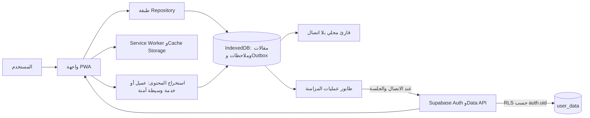

# تقرير تحليل Omni Reader وخطة الترحيل إلى Web Application

**إعداد:** Manus AI  
**النطاق:** تحليل فقط؛ لم يبدأ نقل الوظائف أو كتابة النسخة الجديدة.  
**مصدر التحليل:** أرشيف إضافة Chrome/Edge المرفق، وعدد ملفاته 20 ملفًا، وتعليمات التحويل المصاحبة له.

> **القرار المعماري المقترح:** تحويل المنتج إلى PWA مستقلة تعمل بأسلوب **Offline-first**. يحتفظ التطبيق بالمحتوى الذي حفظه المستخدم، مكتبته، ملاحظاته، تمييزاته، وتفضيلات القراءة محليًا، ثم يزامن التغييرات اختياريًا عند عودة الاتصال. لا يمكن لتطبيق ويب عادي أن يحقن واجهة داخل أي تبويب أو يقرأ التبويب النشط كما تفعل الإضافة؛ لذلك ستُنفّذ هذه الميزات عبر مسار حفظ/قراءة داخل التطبيق وبدائل واضحة أدناه.

## 1. ما الذي يحتويه المشروع الحالي؟

الإضافة هي **Omni Reader**، وهي قارئ مقالات مع مكتبة «اقرأ لاحقًا». تعمل وفق Manifest V3، وتفصل مسؤولياتها بين نافذة Popup صغيرة، وصفحة مكتبة كاملة، Service Worker في الخلفية، وContent Script يحقن وضع القراءة فوق الصفحة الأصلية. تستخدم مكتبة Readability محليًا لاستخراج المقالات، و`chrome.storage.local` لحفظ البيانات، وSupabase REST + Auth لمزامنة اختيارية بين الأجهزة.

| الطبقة | الملفات الرئيسية | المسؤولية الفعلية |
|---|---|---|
| تعريف الإضافة | `manifest.json` | الصلاحيات، الـPopup، اختصار Alt+R، Service Worker، وإتاحة Content Script على جميع الروابط. |
| الخلفية | `core/background.js` | حقن سكربت القارئ، رسالة تبديل القارئ، قائمة النقر بالزر الأيمن، ومزامنة مؤجلة بعد تغيّر البيانات. |
| القراءة داخل الموقع | `core/content.js` و`ui/reader.css` | استخراج النص، واجهة قارئ عائمة، الفصول، التفضيلات، الإشارات المرجعية، الوقت، التمييز، والملاحظات. |
| المكتبة | `ui/library/*` | مكتبة المقالات، البحث والمرشحات، الوسوم والمجلدات، قارئ محفوظ يعمل على المحتوى المخبأ، الاستيراد/التصدير، والإعدادات. |
| التحكم السريع | `ui/popup.*` | قراءة الصفحة الحالية، الحفظ السريع، قائمة مهام المواقع، إحصاءات مختصرة، ومزامنة الحساب. |
| التخزين والتزامن | `core/storage.js` و`core/sync.js` | واجهة تخزين موحّدة، نماذج بيانات، Supabase Auth، تحديثات زمنية، دمج تعارضات، وتتبع الحذف. |
| الاعتماديات المضمنة | `features/Readability*.js` | استخلاص المقالات من DOM أو HTML محفوظ. |

## 2. الخصائص وتدفقات الاستخدام الحالية

ينطلق التدفق المعتاد من صفحة ويب مفتوحة. يضغط المستخدم زر الإضافة أو الاختصار `Alt+R`، فتقرأ الإضافة DOM للصفحة ثم تعرض قارئًا عائمًا فوقها. يتيح القارئ تعديل الخط والعرض والمحاذاة والاتجاه والثيم والصور، ويحسب وقت القراءة ويحفظ موضع التمرير. يستطيع المستخدم حفظ الصفحة أو النص المستخلص في المكتبة، ثم قراءته لاحقًا دون اعتماد على الصفحة الأصلية إذا كان النص قد خُزّن بنجاح.

تُدير المكتبة المقالات ككيانات قابلة للوسم، الإسناد إلى مجلد، التمييز كمهم أو مقروء أو مؤرشف، والبحث في العنوان والرابط والنص المستخرج. وتشمل شاشة منفصلة للملاحظات والتمييز، مع حفظ اقتباس محدد كنقطة انطلاق للملاحظة وإتاحة تغيير اتجاه تحريرها. كما توفر المكتبة قارئًا كامل الشاشة، وصوت القراءة عبر Web Speech، والطباعة، والتصدير كـHTML، والإرسال عبر `mailto:`.

| المجال | الوظائف المؤكدة من الشفرة |
|---|---|
| القراءة والاستخراج | Readability، محاولات استخلاص خاصة بمواقع الفصول، معالجة صور lazy-loading، تنظيف عناصر الإعلان، كشف ترميز الصفحة، التنقل بين الفصل التالي/السابق، وفهرس داخلي مبني من العناوين. |
| التخصيص وإتاحة الوصول | حجم ونوع الخط، عرض النص، تباعد السطور والكلمات، محاذاة، RTL، إخفاء الصور، أربعة ثيمات، اختصارات داخل المكتبة، ووضع ملء الشاشة. |
| المكتبة | حفظ رابط أو مقال، عرض شبكي/قائمة، بحث، ترتيب، حالة مقروء/مهم/مؤرشف، وسوم، مجلدات، استكمال القراءة، تقدير زمن القراءة، وسجل قراءة. |
| التعليقات | تمييز نص، حذف التمييز، استعادة تمييزات محفوظة، ملاحظات مرتبطة بالرابط أو النطاق، اقتباس محمي داخل الملاحظة، وواجهة موحّدة للملاحظات والتمييز. |
| نقل البيانات | تصدير نسخة JSON، CSV، HTML bookmarks، واستيراد JSON وPocket HTML وInstapaper CSV. |
| المزامنة | إنشاء حساب/تسجيل دخول/استعادة كلمة مرور عبر Supabase، مزامنة يدوية وتلقائية، تعارضات لقيم بسيطة، ودمج سجلات القوائم مع احترام الحذف المحلي. |
| التحكم السريع | حفظ الصفحة أو الرابط من قائمة السياق، قائمة مهام مرتبطة بالمواقع، تفعيل قارئ تلقائي عالمي أو حسب نطاق، إحصاءات صفحات/إشارات/وقت/ملاحظات. |

## 3. نموذج البيانات والتخزين الحالي

التخزين المحلي الحالي متمحور حول مفاتيح `reader_*`. الإشارات المرجعية مخزن ككائن مفهرس بالرابط وتحتوي العنوان، النص HTML الاختياري، صورة، قراءة مقدرة، حالة القراءة/الأرشفة/الأهمية، وسوم، مجلد، نسبة تمرير، وتاريخ الفتح. الملاحظات مصفوفة كائنات مرتبطة بـURL أو نطاق؛ والتمييز كائن مفهرس بالرابط، يحفظ النص وسياقًا سابقًا للمساعدة على الاستعادة. توجد أيضًا تفضيلات عامة وتفضيلات قارئ لكل مقال، وسجل وقت القراءة، وطوابع المزامنة وسجل الحذف.

| الكيان | الحقول الجوهرية الملاحظة | المصير المقترح في الويب |
|---|---|---|
| Article / Bookmark | `url`، `title`، `text`، `image`، `tags`، `folderId`، `read`، `archived`، `important`، `scroll` | جدول IndexedDB مستقل مع فهرسة على URL وتاريخ الحفظ والحالة والنص للبحث. |
| Note | `id`، `url`، `domain`، `content`، `isRTL`، `created`، `lastModified` | كيان IndexedDB مستقل؛ يعامل HTML الوارد بعزل وتعقيم قبل العرض. |
| Highlight | `id`، `text`، `textBefore/context` | كيان تابع للمقال، مع محدد نصي وسياق بدل تخزين DOM قابل للكسر. |
| Folder / Tag | `id` و`name` أو سلاسل وسوم | جداول/علاقات محلية واضحة، مع فهرس عدة-إلى-عدة للوسوم. |
| Preferences | إعدادات القراءة والمظهر | سجل إعدادات محلي مع نسخة قابلة للمزامنة. |
| Sync metadata | طوابع تغيّر وحذف وآخر مزامنة | سجل عمليات محلي `outbox` يضمن sync عند عودة الاتصال. |

## 4. اعتماديات Chrome/Edge وبدائل الويب

| وظيفة الإضافة | التطبيق الحالي | المكافئ في الويب | القيد أو المعالجة |
|---|---|---|---|
| وضع القارئ فوق الصفحة المفتوحة | `content.js` + حقن CSS/JS | صفحة قارئ داخل PWA تعرض المحتوى المحفوظ | لا يحق للويب حقن واجهة في تبويب موقع آخر. يستعاض عنها بـ«حفظ ثم قراءة» وبـbookmarklet اختياري لحفظ الصفحة بإجراء صريح من المستخدم. |
| معرفة التبويب النشط وحفظه بضغطة واحدة | `chrome.tabs.query` و`activeTab` | إدخال URL، Web Share Target حيث يدعمه المتصفح، وbookmarklet | لا يوجد Active Tab API في الويب العادي. |
| استخراج محتوى أي موقع | Content Script وصلاحية `<all_urls>` | استخراج في العميل إن سمح CORS؛ Edge Function/خدمة وسيطة محمية عندما يلزم | CORS يمنع الاستنساخ الكامل من العميل. يجب تقييد أي Proxy ضد SSRF واحترام سياسات المواقع. |
| قائمة النقر بالزر الأيمن | `chrome.contextMenus` | bookmarklet أو زر مشاركة في التطبيق | لا يمكن إضافة عنصر إلى قائمة المتصفح الأصلية من موقع ويب. |
| اختصار Alt+R عالمي | `chrome.commands` | اختصارات داخل التطبيق فقط | لا يمكن اعتراض اختصار عالمي أثناء تصفح مواقع أخرى. |
| الفتح التلقائي حسب نطاق | Content Script عند كل تحميل | قواعد حفظ/فتح داخل PWA وفلترة المصدر | لا يمكن تشغيل صفحة الويب تلقائيًا عند زيارة نطاق خارجي. |
| CSS/JS مخصص على المواقع | حقن قواعد إلى DOM الموقع | قواعد تحويل آمنة للمحتوى المحفوظ، وCSS محدود خاص بالقارئ | لا يُنقل تنفيذ JavaScript حر على مواقع الغير؛ هذا يوسع سطح XSS ويحتاج امتياز الإضافة أصلًا. |
| التخزين والإشعارات الداخلية | `chrome.storage.local` وService Worker | IndexedDB + Cache Storage + Service Worker + Notification API عند منح الإذن | تتطلب الإشعارات إذن المستخدم، ولا يوجد تنفيذ فعلي حالي لخوادم الملخص الأسبوعي. |
| Auto-sync بالخلفية | Background service worker | Queue محلية ثم sync عند `online`، وعند فتح التطبيق أو عبر Background Sync حيث يتوفر | Background Sync غير مدعوم بانتظام في كل المتصفحات؛ يجب أن يكون التدفق مرنًا ولا يعتمد عليه وحده. |
| فتح رابط في تبويب | `chrome.tabs.create` | رابط عادي `target="_blank"` و`window.open` بإجراء مستخدم | قابل للنقل مباشرة. |
| صوت وطباعة وملء الشاشة وتنزيل | واجهات Web قياسية داخل صفحة المكتبة | Web Speech وPrint وFullscreen وBlob download | قابلة للنقل مباشرة، مع تفاوت أصوات النظام بين الأجهزة. |

## 5. تدقيق الاعتمادات وSupabase RLS

أظهر المسح الساكن للأرشيف وجود رابط مشروع Supabase ومفتاح JWT قديم مستخدم كـ`SUPABASE_ANON_KEY` في `core/sync.js`. فُكّت **حمولة** المفتاح محليًا دون إعادة عرضه، وكانت مطالبة الدور `role: "anon"` ولم تتضمن `service_role`. ولم يظهر المسح في الملفات المتاحة لأي Service Role، أو `sb_secret_*`، أو مفاتيح AWS، أو مفاتيح خاصة، أو ملفات `.env`، أو بيانات Git/remote. من ثم، لا يوجد في الأرشيف المرفق دليل على تسريب اعتماد إداري خاص.

لكن هذه النتيجة ليست إثباتًا على أن مستودع GitHub خالٍ من الأسرار: الأرشيف لا يحمل مجلد `.git` ولا رابط المستودع ولا تاريخ الالتزامات. كما تعذّر فحص نقطة REST الحالية فحصًا رأسياً بلا بيانات بسبب فشل حل DNS لاسم نطاق المشروع في بيئة التحليل؛ لذلك لا يمكن الجزم من هذه الملفات وحدها بأن RLS مفعّلة أو أن سياساتها المنشورة صحيحة.

| بند التدقيق | النتيجة | الحكم | الإجراء قبل الإطلاق |
|---|---|---|---|
| Service Role أو مفتاح سري في الواجهة | لم يُعثر عليه في الأرشيف؛ المفتاح الموجود يحمل دور `anon` | مقبول مبدئيًا | استبدال المفتاح القديم بمفتاح publishable حديث عند الترحيل، أو إبقاء anon في متغير عام فقط. |
| Access/refresh tokens للمستخدمين | لا توجد قيمة جلسة ثابتة في الملفات؛ تحفظ الإضافة الجلسة محليًا وقت التشغيل | مقبول مبدئيًا | لا تسجل رموز الجلسة أو تعرضها في أخطاء/تحليلات. |
| GitHub | لا يوجد remote أو تاريخ Git داخل الأرشيف | غير قابل للتحقق | فحص المستودع الفعلي وSecrets/History، ثم تدوير أي سر إن عُثر عليه. |
| RLS على `user_data` | لا توجد DDL أو Policies أو صلاحية Dashboard ضمن الأرشيف | غير قابل للتحقق | مراجعة SQL Editor أو Security Advisor واختبارات المستخدم أ/ب قبل الانتقال. |
| التطبيق غير الموثق | واجهات الإشعارات تعرض في UI، لكن لا يظهر تدفق خادم فعلي للرسائل/الملخص الأسبوعي | معلّق | لا يُفعّل إلا بخدمة خلفية منفصلة ومفاتيح سرية محصورة فيها. |

وفق Supabase، مفتاح `anon` القديم يعامل كمفتاح قابل للنشر وليس سرًا، لكن أمنه مشروط بتمكين RLS وسياسات أقل صلاحية. أمّا مفاتيح Service Role/secret فتتجاوز RLS ولا يجوز وجودها في المتصفح أو المستودع العام. [1] [2] [3]

### سياسة RLS المطلوبة لبيانات المزامنة

يفترض كود المزامنة جدولًا باسم `public.user_data` بمفتاح فريد مركب على `(user_id, data_key)`، وبيانات JSON في `data_value`. يجب تنفيذ SQL التالي **من جهة موثوقة في Supabase Dashboard أو migrations محمية**، وليس من التطبيق:

```sql
alter table public.user_data enable row level security;

revoke all on table public.user_data from anon;
grant select, insert, update, delete on table public.user_data to authenticated;

create policy "users manage only their own sync data"
on public.user_data
for all
to authenticated
using (
  (select auth.uid()) is not null
  and user_id = (select auth.uid())
)
with check (
  (select auth.uid()) is not null
  and user_id = (select auth.uid())
);

create index if not exists user_data_user_id_idx
on public.user_data (user_id);
```

ينبغي بعد ذلك اختبار القراءة والإدراج والتحديث والحذف باستخدام حسابين مختلفين، والتأكد أن المستخدم لا يستطيع قراءة أو تعديل صف المستخدم الآخر حتى لو غيّر `user_id` يدويًا في الطلب. تبيّن الإرشادات الرسمية أن RLS يجب أن تكون مفعلة للجداول الموجودة في schema مكشوف، وأن سياسة الملكية تعتمد على `auth.uid()` في `USING` و`WITH CHECK`. [1]

## 6. البنية المقترحة للنسخة المستقلة

لا تحتاج الوظائف المحلية الأساسية إلى Backend. ستبنى الواجهة كتطبيق React + TypeScript، وستُستخدم IndexedDB عبر طبقة Repository typed لحفظ المقالات والملاحظات والتمييز وOutbox عمليات المزامنة. يعمل Service Worker كـApp Shell: يخبئ حزم التطبيق وخطوطه وأصوله في أول زيارة، ثم يقدّمها من Cache Storage عند انقطاع الإنترنت. عند حفظ مقال، تُخزّن نسخة HTML معقمة وأي صور اختار المستخدم الاحتفاظ بها محليًا؛ وعندها تظل شاشة القراءة متاحة تمامًا دون اتصال.

تبقى المزامنة اختيارية ومنفصلة. تستخدم الواجهة Supabase Auth ومفتاح publishable/anon فقط، مع RLS؛ وعندما يعود الاتصال تُدفع العمليات من Outbox وتُسحب تغييرات المستخدم. ستستمر القراءة والتحرير محليًا حتى لو فشلت الشبكة أو انتهت الجلسة، وتظهر للمستخدم حالة «بانتظار المزامنة» بدل خسارة تغييره. من دون ربط حساب، يبقى التطبيق صالحًا كـPWA محلية بالكامل.

| الطبقة | التقنية المقترحة | السبب |
|---|---|---|
| الواجهة | React 19 + TypeScript + Wouter + المكونات المتاحة | يلائم المشروع المنشأ، ويدعم صفحات المكتبة والقارئ والإعدادات دون تعقيد. |
| الحالة | مخزن React خفيف مع Repository مهيأ للاختبار | فصل حالة الواجهة عن عمليات IndexedDB والمزامنة. |
| العمل دون اتصال | IndexedDB + Cache Storage + Service Worker/PWA manifest | تخزين بيانات المستخدم والأصول والمقالات المحلية بعد الزيارة الأولى. |
| البحث | فهرسة محلية للعناوين والوسوم والنص | البحث يعمل بلا شبكة؛ يبدأ بسيطًا وقابل للترقية إلى full-text index. |
| قراءة المحتوى | Readability من المصدر الحالي بعد تحديثه وتنظيمه كاعتماد | إعادة استخدام منطق المنتج لاستخلاص HTML في التدفقات المسموح بها. |
| التزامن | Supabase Auth + REST/SDK بمفتاح publishable وRLS | يبقي الحساب والمزامنة، ولا يتطلب خادمًا خاصًا للعمليات الحالية. |
| استخراج عبر CORS | Edge Function/Proxy اختياري شديد التقييد | يُستخدم فقط عندما تمنع CORS الاستخراج، ولا يخزن أي سر في الواجهة. |
| الحماية | Sanitizer للمحتوى المحفوظ، CSP، RLS، وعدم تنفيذ نصوص مخصصة | المقالات والملاحظات HTML غير موثوقة ولا تُعرض عبر `innerHTML` بلا تعقيم. |

## 7. تدفق البيانات المقترح



## 8. خطة الترحيل المقترحة

| المرحلة | النطاق | ناتج القبول |
|---|---|---|
| 0. خط أساس أمني | مراجعة GitHub الفعلي، تدوير أي سر محتمل، اعتماد RLS واختبار حسابين، ونقل الإعدادات العامة إلى متغيرات Build | لا Service Role أو secret في العميل، وRLS مثبتة باختبارات ملكية. |
| 1. أساس Offline-first | نموذج Typed، IndexedDB، PWA manifest، Service Worker، ترحيل/استيراد نسخة JSON الحالية، وحالة Offline/Outbox | فتح التطبيق واستخدام المكتبة المحفوظة بعد أول زيارة بلا اتصال. |
| 2. المكتبة | المقالات، الوسوم، المجلدات، البحث، الأرشفة، سجل القراءة، الاستيراد والتصدير، وحالات فارغة/فشل | تغطية كل وظائف المكتبة الأساسية دون Chrome APIs. |
| 3. القارئ والتعليقات | قارئ محفوظ، التخصيص، RTL، الصوت، الطباعة، التمييز والملاحظات، تقدّم القراءة، الفصول | يمكن للمستخدم فتح مقال مخزن وقراءته وتعديل تعليقاته دون اتصال. |
| 4. الحفظ من الويب والمزامنة | إدخال URL، bookmarklet/Web Share، استخراج CORS والخدمة الاختيارية، Supabase login/sync/conflicts | حفظ جديد واضح القيود؛ مزامنة اختيارية لا تؤثر في الاستخدام المحلي. |
| 5. التحقق | اختبارات Unit للتخزين والدمج، E2E للتدفقات، فحص Offline، responsive، CSP وRLS، واختبارات أخطاء الشبكة | جدول مقارنة مكتمل بين الإضافة والويب، مع توثيق أي قيد متأصل في المتصفح. |

## 9. شروط الموافقة قبل التنفيذ

أوصي بالبدء بالترحيل بعد اعتماد نقطتين: أولًا، اعتماد **تطبيق PWA محلي بالكامل مع مزامنة اختيارية** بدل اشتراط شبكة دائمة. ثانيًا، اعتماد البدائل المفروضة تقنيًا لميزات الحقن والتبويب النشط: bookmarklet/Web Share/إدخال URL للحفظ، وقواعد تحويل آمنة للمحتوى المخزن بدل تنفيذ JavaScript حر في مواقع طرف ثالث.

ولإغلاق التدقيق الأمني إلى حكم نهائي، يلزم واحد من الآتي: رابط مستودع GitHub أو أرشيف يحوي `.git` لتفتيش التاريخ، وصلاحية عرض مشروع Supabase أو تصدير SQL/لقطات Policies لتأكيد RLS المنشورة. دون ذلك، يمكن إثبات أن الأرشيف المرفق لا يحتوي سرًا إداريًا ظاهرًا، لكن لا يمكن التصديق على حالة GitHub أو قاعدة البيانات الحية.

## المراجع

[1]: https://supabase.com/docs/guides/database/postgres/row-level-security "Supabase Docs — Row Level Security"
[2]: https://supabase.com/docs/guides/database/secure-data "Supabase Docs — Securing your data"
[3]: https://supabase.com/docs/guides/getting-started/api-keys "Supabase Docs — Understanding API keys"
